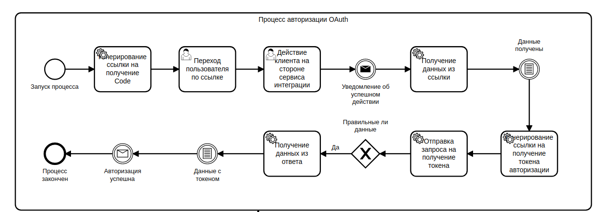

# hubstaff_api
#### Инструкция по интеграции с HubStaff Service с применением API V2

##### Процессы 
- OAuth авторизация
- HubStaff API V2 (Пользователи, организации, задачи, активности.)

##### Python зависимости
- httpx
- pydantic

<br>

##### Основной ресурс для работы  https://developer.hubstaff.com/
## Добавления приложения в HubStaff
- Создайте приложения в HubStaff <br>
https://developer.hubstaff.com/apps *>>* New App <br>
Важно **homepage_url и redirect_uris** должны быть домены https если разрабатываете локально используйте **ngrok**
Карточка приложения после создания:
```
NAME My App
DESCRIPTION -
HOMEPAGE URL https://41095d8af8a2.ngrok.io
CONTACT EMAIL your_email@gmail.com
OAuth configuration

CLIENT ID 1PZ9zOi5sZNE6-93gHE5ZAQpX*******
CLIENT SECRET RSwPUs8i2vsrxodnI-xEycxFbN-******
REDIRECT URLS https://41095d8af8a2.ngrok.io/webhook/login
```
Если используете ngrok вам придется менять карточку приложения каждый раз когда истекает действие работы ngrok (каждые 2 часа)

- Скопируйте и вставьте значения CLIENT_ID и CLIENT_SECRET в ваше приложение.

## OAuth авторизация
#### OAuth авторизация происходит следующим образом:

### Воспроизведение процесса кодом
- Генерирование ссылки на получение Code
```
from hubstaff.service import HubStaffOAuth

# State - Данные которые вернутся на вебхук
# используется для идентификации пользователя
state = dict(user_id=1)

# Наш webhook который установили в HubStaffApp
redirect_uri = https://41095d8af8a2.ngrok.io/webhook/login

url = HubStaffOAuth.get_code_url(redirect_uri, state)
print(url)

>>> 'https://account.hubstaff.com/authorizations/new?client_id=1PZ9zOi5sZNE6-93gHE5ZAQpX*******&response_type=code&nonce=284d703a-c1fc-466b-918f-cfefe8edf933&state=eyJ4IjogMX0=&scope=openid hubstaff:read profile tasks:read&redirect_uri=https://41095d8af8a2.ngrok.io/webhook/login'
```
Эту ссылку необходимо отдать пользователю для перехода по ней. <br>
Для допольнительной информации по get параметрам https://developer.hubstaff.com/authentication <br>

- Прием уведомления об успешном входе (WebHook)
```
from oauth.webhooks import login_success

def login_success_to_system(request):
   code, state = login_success(request)
   print(code, state)

>>> login_success_to_system(request)
>>> 6655746, dict(user_id=1)
```

- Получение авторизационных данных (access_token, refresh_token)
```
from hubstaff.service import HubStaffOAuth

token_data = await HubStaffOAuth().get_token(
    code, redirect_uri, is_basic_token=True
)

print(token_data)
>>> dict(token=dict(access_token=***, refresh_token=***))
```
После успешного получения токена авторизации можно использовать HubStaff API


### Использование HubStaff API V2
После получения токена авторизации его необходимо передавать в Headers каждого запроса.
```
from hubstaff.service import HubStaff

hubstaff = HubStaff(f"{token_data['token']['access_token']}")

hub_staff_user = await hubstaff.get_user()
print(hub_staff_user)
>>> dict(user=dict(id=123, name=AlexDemure, email=your_email@gmail.com)
```
